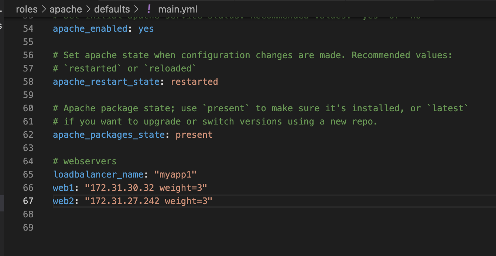

# ANSIBLE DYNAMIC ASSIGNMENTS (INCLUDE) AND COMMUNITY ROLES

This project is continuation of Project-12. In Project-12 we considered Stating assignment which we used 'import' Ansible module, for Project-13 we shall be considering Dynamic assignment which ansible module is 'include'.

The difference between this two ansible modules is that When the 'import' module is used, all statements are pre-processed at the time playbooks are parsed. Meaning, when you execute site.yml playbook, Ansible will process all the playbooks referenced during the time it is parsing the statements. This also means that, during actual execution, if any statement changes, such statements will not be considered. Hence, it is static.

On the other hand, when 'include' module is used, all statements are processed only during execution of the playbook. Meaning, after the statements are parsed, any changes to the statements encountered during execution will be used.

## INTRODUCING DYNAMIC ASSIGNMENT INTO OUR STRUCTURE

- From ansible-config-mgt repository created a new branch and named it dynamic-assignments

- Created a new folder, named it dynamic-assignments. Then inside this folder, created a new file and named it env-vars.yml.

Since we will be using the same Ansible to configure multiple environments, and each of these environments will have certain unique attributes, such as servername, ip-address etc., we will need a way to set values to variables per specific environment. For this reason, we need to create a folder to keep each environment’s variables file. Therefore, 

- created a new folder env-vars, then for each environment, created new YAML files which we will use to set variables.

- hence, the layout looks like this;


- Pasted the instruction below into the env-vars.yml file.


There are three things to be notice here

1. include_vars syntax was used instead of include, this is because Ansible developers decided to separate different features of the module. From Ansible version 2.8, the include module is deprecated and variants of include_* must be used. These are:
        
     - include_role
     - include_tasks
     - include_vars

    In the same version, variants of import were also introduces, such as:

    - import_role
    - import_tasks

2. We made use of a special variables { playbook_dir } and { inventory_file }. { playbook_dir } will help Ansible to determine the location of the running playbook, and from there navigate to other path on the filesystem. { inventory_file } on the other hand will dynamically resolve to the name of the inventory file being used, then append .yml so that it picks up the required file within the env-vars folder.

3. We are including the variables using a loop. with_first_found implies that, looping through the list of files, the first one found is used. This is good so that we can always set default values in case an environment specific env file does not exist.

## UPDATE SITE.YML WITH DYNAMIC ASSIGNMENTS

- Updated site.yml file to make use of the dynamic assignment.  


Updated the changes made to github 


Now it is time to create a role for MySQL database – it should install the MySQL package, create a database and configure users. But why should we re-invent the wheel? There are tons of roles that have already been developed by other open source engineers out there. These roles are actually production ready, and dynamic to accomodate most of Linux flavours. With Ansible Galaxy again, we can simply download a ready to use ansible role, and keep going.

### Download Mysql Ansible Role

- We will be using a MySQL role developed by geerlingguy.

- On Jenkins-Ansible server make sure that git is installed with git --version, then go to ‘ansible-config-mgt’ directory and run.

```
git init
git pull https://github.com/<your-name>/ansible-config-mgt.git
git remote add origin https://github.com/<your-name>/ansible-config-mgt.git
git branch roles-feature
git switch roles-feature
```


- Inside roles directory created a new MySQL role with ansible-galaxy and installed geerlingguy.mysql and renamed the folder to mysql

```
ansible-galaxy install geerlingguy.mysql

mv geerlingguy.mysql/ mysql
```

- Read README.md file, and edited roles configuration to use correct credentials for MySQL required for the tooling website


- Uploaded the changes into my github.
```
git add .
git commit -m "Commit new role files into GitHub"
git push --set-upstream origin roles-feature
```

### LOAD BALANCER ROLES

We want to be able to choose which Load Balancer to use, Nginx or Apache, so we need to have two roles respectively:

- Nginx
- Apache

- Installed the Nginx Ansible Role and renamed the folder to nginx

```
ansible-galaxy install geerlingguy.nginx
mv geerlingguy.nginx/ nginx
```

- Installed the Apache Ansible Role and renamed the folder to apache

```
ansible-galaxy install geerlingguy.apache 
mv geerlingguy.apache/ apache
```


- Using the README.md file of nginx to tweak the configuration 

- Started configuration with `defaults/main.yml` refer to the images below


- Using the README.md file of Apache to tweak the configuration 

- Started configuration with `defaults/main.yml` refer to the image below 




Since we cannot use both Nginx and Apache load balancer, we need to add a condition to enable either one – this is where we can make use of variables.

- we declare a variable in defaults/main.yml file inside the Nginx and Apache roles. Named each variables `enable_nginx_lb` and `enable_apache_lb` respectively.

- Set both values to false like this; `enable_nginx_lb: false` and `enable_apache_lb: false`.

- Declare another variable in both roles load_balancer_is_required and set its value to false as well

- Steps above can be seen in  the image below


- Update both assignment and site.yml files respectively. refer to the images below


- Now we can make use of `env-vars\uat.yml` file to define which loadbalancer to use in UAT environment by setting respective environmental variable to true.

- we will activate load balancer, and enable nginx by setting these in the respective environment’s env-vars file.


- The same must work with apache LB, so we can switch it by setting respective environmental variable to true and other to false.

- executed the ansible playbook

```
ansible-playbook -i inventory/uat.yml  playbooks/site.yml
```


The different load balancers were installed succesfully and are  up and running.